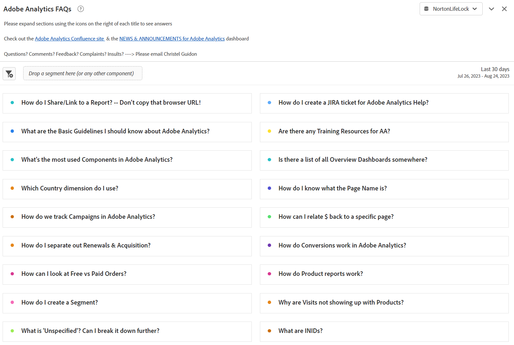
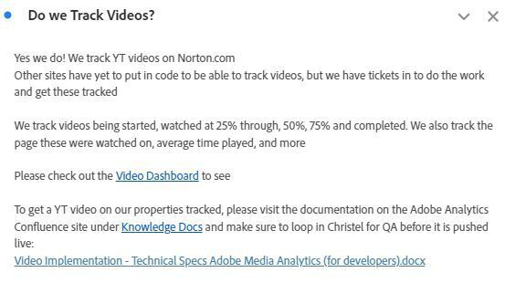

# Creación de paneles operativos en Analysis Workspace

_Explore cómo los paneles operativos de [!DNL Adobe Analytics] Workspace revolucionan la comunicación y la eficacia. Descubra cómo crear preguntas frecuentes, noticias y anuncios, y tableros de errores y características para obtener información optimizada, experiencia de usuario mejorada y participación mejorada._

Como muchos administradores, ejecuto un centro de información interno (Confluencia o similar) para [!DNL Adobe Analytics]. Con el tiempo, me harté de responder a las mismas preguntas una y otra vez y necesitaba una manera más fluida de llegar a mis usuarios sin sentir que les hacía ping y les molestaba todo el tiempo. Necesitaba repositorios para información que fuera menos estática.

Observé que los usuarios a menudo ignoraban mis referencias al sitio de Confluencia, con razones como &quot;Mi VPN está desactivada&quot;, o &quot;No puedo leerla ahora&quot;, etc. Básicamente, &quot;leeré ese documento más tarde&quot; significa que nunca se leerá, y la misma pregunta se volverá a hacer la semana que viene.

***El éxito de realización:**La versatilidad de Workspace podría cambiar las reglas del juego. Los usuarios prefieren respuestas rápidas y directas dentro de Workspace, así que mantengámoslas allí para evitar pasos adicionales.*

Seguí adelante y creé paneles operativos para compartir toda la compañía. Hasta ahora, han mantenido a los usuarios informados, han centralizado la información y han reducido la frustración. Este ha sido un proceso fácil y cambiante que aumenta la eficiencia con el tiempo.

La gente ha podido obtener mucha información buena sin mí, entender las áreas del sitio, ver lo genial que es [!DNL Adobe Analytics] y (importante para mí ??) hacerme menos preguntas y dedicar menos tiempo.

**Recomiendo encarecidamente que cree paneles para todas las propiedades o áreas principales del sitio.**: deben proporcionar una descripción general de la propiedad, el sitio, la aplicación o el flujo, así como información básica y rápida. Deben compartirse con toda la compañía, lo que permite a todos los usuarios comprender la propiedad sin ningún tipo de sujeción. Para mí, estos paneles suelen responder al 80% de las preguntas que recibo y me ahorran un tiempo valioso.

Nada de esto le impide mantener su sitio de Confluencia, que sigue siendo muy útil tener. Incluso lo menciono en la parte superior de cada panel operativo. Pero me encantan los métodos abreviados, tanto para mí como para mis usuarios.

Permítanme guiarles a través de los tres paneles operativos que creé para mi empresa, GenDigital, que me ayudaron a alcanzar estos objetivos.

1. Preguntas frecuentes
1. Noticias y anuncios
1. Registro de errores, funciones y versiones principales

## 1 - Panel de preguntas frecuentes

¿Cansado del bucle interminable de respuestas repetidas? ¡Detente! Ahorre tiempo creando un panel de preguntas frecuentes. Los usuarios pueden consultarlo antes de preguntar o puede vincularlo rápidamente en sus respuestas.

Basta con crear [visualizaciones de texto](https://experienceleague.adobe.com/docs/analytics/analyze/analysis-workspace/visualizations/text.html) con preguntas formateadas como títulos y respuestas/explicaciones como contenido, todo contraído para mostrar únicamente la pregunta. Agrúpelas por relevancia (p. ej., páginas o productos) o utilice paneles. Simplifique y priorice las consultas comunes en la parte superior.

En lugar de escribir correos electrónicos largos o redescubrir explicaciones antiguas, actualice el panel de preguntas frecuentes. Empiece ahora y amplíe con el tiempo. Use hipervínculos para hacer referencia a otros tableros o preguntas más frecuentes relacionadas dentro de los informes. Proporcione un contexto complejo cuando sea necesario vinculando desde otros paneles a las preguntas frecuentes.

Para Gen Digital, nuestras preguntas frecuentes se centran en el uso personalizado de [!DNL Adobe Analytics], no en conceptos básicos. Para enviar correos electrónicos a vínculos de preguntas más frecuentes específicos, haga clic con el botón derecho, seleccione &quot;obtener vínculo de visualización&quot; y comparta la URL mnemónica. Esto resalta el contenido exacto para los usuarios. Utilice tablas de forma libre para la ilustración de datos y añada más explicaciones con &quot;editar descripción&quot;.

Una vez que sus preguntas frecuentes se sientan completas, compártalas con la compañía para el acceso colectivo y el aprendizaje. Siga mejorando según sea necesario.

Estas son algunas capturas de pantalla del aspecto que puede tener un panel de preguntas frecuentes:

## 2 - Panel de noticias y anuncios

Otro tablero operativo útil es un tablero de noticias y anuncios. Comencé este porque quería sacar información a mis usuarios, pero sentí que les hacía ping y les molestaba en su lugar. ¿Todos necesitan esta actualización? ¿Qué usuarios? ¿Solo usuarios avanzados? ¿Debería enviar un boletín semanal que nadie va a leer? Al tener la actualización directamente en Workspace, los usuarios pueden verla en cuanto inicien sesión y no necesito enviar otro correo electrónico de la compañía que nadie quiera leer.

Dado que estos paneles se ven en toda la compañía, las actualizaciones ascienden a la parte superior inmediatamente. Este es el tipo de información que incluyo en el panel de noticias y anuncios:

- Versiones de funcionalidades y actualizaciones de nuestro lado (principalmente versiones de código)
- Nuevas características importantes de [!DNL Adobe]
- Horario de oficina
- Lista de todos los paneles de información general e informes geniales que se deben consultar

Abarca nuestras nuevas funcionalidades, seguimiento y paneles vitales. Los hipervínculos en los informes de texto (o en la parte superior de otros informes a través del botón secundario y editar descripción) le permiten vincular otros tableros en la página de lanzamiento de funciones de [!DNL Adobe Analytics] o [!DNL Adobe].

Este es el aspecto de mi tablero de noticias y anuncios:

## 3 - Registro de errores, funciones y versiones principales

El objetivo de este tablero operativo es tener un lugar central para colocar todos los errores y errores. Antes esto se administraba en Excel, pero era engorroso y difícil de compartir. ¿Por qué no ponerlo directamente en Workspace?

Puede integrarlo en el panel Noticias y anuncios si desea que tenga menos protagonismo. Sin embargo, si la creación de informes de errores es sustancial o crítica para su empresa, puede ser aconsejable utilizar un tablero independiente.

Utilizo una visualización de texto y la simplifico mucho con puntos de viñeta. El punto de viñeta lleva como prefijo la fecha del error, así como la propiedad (por ejemplo: &quot;3jan23-17jan23 - Norton.com&quot;, &quot;Prior to 14sep22 - Chat&quot;). A continuación, añado los detalles y trato de mantenerlo corto y conciso. Evito indicar qué equipo fue el culpable y evito agregar demasiados detalles técnicos que probablemente no les importen a sus usuarios.

El error más reciente se encuentra en la parte superior, mientras que los más antiguos están en los informes de texto anuales (por ejemplo, &quot;2022: errores conocidos, errores y cambios&quot;), todos contraídos.

Nada lujoso. Realmente fácil de hacer, y debe admitir, mucho mejor que ese archivo de Excel que mantiene en su disco duro y seguir actualizando en Confluence.

También hago referencia a Paneles de información general e Informes interesantes aquí, similares a otros paneles operativos. Los vínculos a las preguntas frecuentes y a los paneles de noticias y anuncios están hacia la parte superior.

A continuación se muestra un ejemplo del aspecto que puede tener el registro:

La creación de paneles operativos en [!DNL Adobe Analytics] Workspace ha cambiado las reglas del juego para mí. Al igual que muchos administradores, gestioné un centro interno y luché con la duplicación de respuestas y la comunicación eficaz de los usuarios. La necesidad de repositorios dinámicos llevó a la comprensión de que la versatilidad de Workspace podía revolucionar la participación. Espero que aproveche el poder de los paneles operativos en [!DNL Adobe Analytics] Workspace. Mejore la experiencia de sus usuarios, ahorre tiempo y disfrute de un entorno más organizado. El recorrido comienza ahora y estos paneles son la clave para la eficacia y la facilidad de uso.

## Autor

Este documento fue escrito por:

**Christel Guidon**, directora de plataforma digital [!DNL Analytics] en Gen

[!DNL Adobe Analytics] campeón
