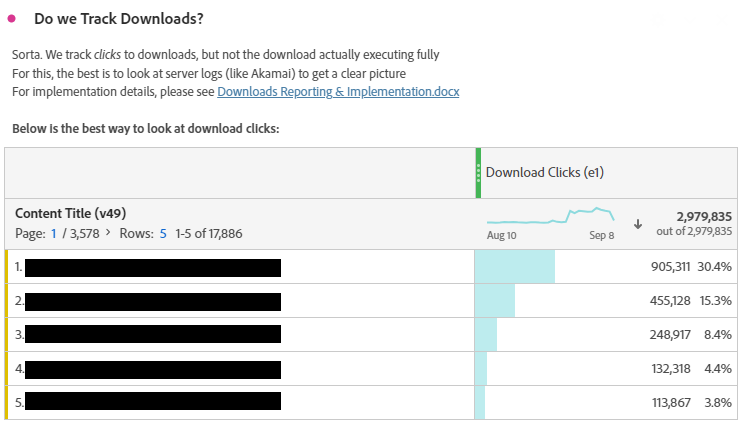

# Creación de paneles operativos en Analysis Workspace

_[!DNL Adobe Analytics]Explore cómo los paneles operativos de Workspace revolucionan la comunicación y la eficacia. Descubra cómo crear paneles de noticias y anuncios, preguntas frecuentes y errores y características para optimizar la información, mejorar la experiencia del usuario y aumentar la participación._

Al igual que muchos administradores, dirijo un centro de información interno (Confluencia o similar) para [!DNL Adobe Analytics]. Con el tiempo, me harté de responder a las mismas preguntas una y otra vez y necesitaba una manera más fluida de llegar a la gente sin tener la sensación de estar molestándola todo el rato. Necesitaba repositorios para información que fuera menos estática.

Observé que a menudo se ignoraban mis referencias al sitio de Confluencia, con razones como “Tengo la VPN desactivada”, o “No puedo leerlo ahora”, etc. Básicamente, “Leeré ese documento más tarde” significa que nunca se leerá, y la misma pregunta se volverá a hacer la semana que viene.

***Me di cuenta de algo:**la versatilidad del Espacio de trabajo podría cambiar las cosas. La gente prefiere respuestas rápidas y directas en el Espacio de trabajo, por lo que debemos mantenerlas allí para evitar pasos adicionales.*

Seguí adelante y creé paneles operativos que compartir con toda la compañía. Hasta ahora, han mantenido a la gente informada, han centralizado la información y han reducido la frustración. Ha sido un proceso fácil y en evolución que aumenta la eficiencia con el tiempo.

La gente ha podido obtener mucha buena información sin mí, entender las áreas del sitio, ver lo genial [!DNL Adobe Analytics] es, y (importante para mí ??) hacerme menos preguntas y dedicarme menos tiempo.

**Le recomiendo encarecidamente que cree paneles para todas las propiedades o áreas principales del sitio.** Deben proporcionar un resumen general de la propiedad, el sitio, la aplicación o el flujo, así como información básica e información rápida. Deben compartirse con toda la compañía, lo que permite a todo el mundo comprender la propiedad sin necesidad de ayuda. Para mí, estos paneles suelen responder al 80 % de las preguntas que recibo y me ahorran un tiempo valioso.

Nada de esto le impide mantener su sitio de Confluencia, que sigue siendo muy útil. Incluso lo menciono en la parte superior de cada panel operativo. Pero me encantan los atajos, tanto para mí como para los demás.

Permítame guiarle a través de los tres paneles operativos que creé para mi compañía, Gen Digital, que me ayudaron a alcanzar estos objetivos.

1. Preguntas frecuentes
1. Noticias y anuncios
1. Registro de errores, funciones y versiones principales

## 1. Panel de preguntas frecuentes

¿Le cansa el bucle interminable de respuestas repetidas? ¡Stop! Ahorre tiempo creando un panel de preguntas frecuentes. La gente puede consultarlo antes de preguntar y usted puede vincularlo rápidamente en sus respuestas.

Simplemente, cree [visualizaciones de texto](https://experienceleague.adobe.com/docs/analytics/analyze/analysis-workspace/visualizations/text.html?lang=es) con las preguntas formateadas como títulos y las respuestas/explicaciones como contenido, todas contraídas para mostrar solo la pregunta. Agrúpelas por relevancia (p. ej., páginas o productos) o use paneles. Procure simplificar, poniendo las consultas más frecuentes en la parte superior.

En lugar de escribir correos electrónicos largos o recuperar explicaciones antiguas, actualice el panel de preguntas frecuentes. Empiece ahora y vaya ampliándolo con el tiempo. Use hipervínculos para hacer referencia a otros paneles o preguntas frecuentes relacionadas dentro de los informes. Proporcione un contexto detallado cuando sea necesario creando vínculos desde otros paneles a las preguntas frecuentes.

Para Gen Digital, nuestras preguntas frecuentes se centran en la personalización [!DNL Adobe Analytics] use, no conceptos básicos. Para enviar por correo electrónico vínculos a preguntas más frecuentes, haga clic con el botón derecho, seleccione “obtener vínculo de visualización” y comparta la URL personalizada. Esto resalta el contenido exacto para las personas usuarias. Utilice tablas de forma libre para ilustrar los datos y añada más explicaciones con “editar descripción”.

Cuando considere que las preguntas frecuentes están completas, compártalas con la compañía para un acceso y aprendizaje colectivos. Siga ampliándolas según sea necesario.

Estas son algunas capturas de pantalla del aspecto que puede tener un panel de preguntas frecuentes:

## 2. Panel de noticias y anuncios

Otro panel operativo útil es uno de noticias y anuncios. Empecé con este porque quería hacer llegar información a la gente, pero me daba la impresión de que molestaba. ¿Necesita todo el mundo esta actualización? ¿Qué personas? ¿Solo las avanzadas? ¿Debería enviar una newsletter semanal que nadie va a leer? Al tener la actualización directamente en el Espacio de trabajo, puede verse en cuanto se inicia sesión y no necesito enviar otro correo electrónico de la compañía que nadie quiera leer.

Dado que estos paneles se ven en toda la empresa, las actualizaciones llegan hasta la cúpula inmediatamente. Este es el tipo de información que incluyo en el panel de noticias y anuncios:

- Versiones de funcionalidades y actualizaciones de nuestro lado (principalmente versiones de código)
- Nuevas funciones importantes de [!DNL Adobe]
- Horario de oficina
- Lista de todos los paneles de información general e informes interesantes que se deben consultar

Abarca nuestros paneles de nuevas funcionalidades, seguimiento y vitales. Los hipervínculos de los informes de texto (o de la parte superior de otros informes mediante el clic con el botón derecho y la descripción de edición) le permiten vincular a otros paneles en [!DNL Adobe Analytics] o [!DNL Adobe]Página de lanzamiento de la función de.

Este es el aspecto de mi panel de noticias y anuncios:

## 3. Registro de errores, funciones y versiones principales

El objetivo de este panel operativo es tener un lugar central para situar todos los errores y fallos. Antes esto se administraba en Excel, pero era engorroso y difícil de compartir. ¿Por qué no ponerlo directamente en el Espacio de trabajo?

Puede integrarlo en el panel de Noticias y anuncios si desea que tenga menos protagonismo. Sin embargo, si la creación de informes de errores es sustancial o crítica para su compañía, puede ser aconsejable utilizar un panel independiente.

Yo empleo una visualización de texto y la simplifico mucho con puntos de viñeta. El punto de viñeta está precedido por la fecha del error, así como por la propiedad (por ejemplo: “3ene23-17ene23 - Norton.com”, “Antes del 14sep22 - Chat”). A continuación, añado los detalles y trato de que sean cortos y concisos. Evito indicar qué equipo tuvo la culpa y no añado demasiados detalles técnicos que probablemente no interesen a las personas usuarias.

El error más reciente se encuentra en la parte superior, mientras que los más antiguos están en los informes de texto anuales (por ejemplo, “2022: errores conocidos, fallos y cambios”), todos contraídos.

Nada del otro mundo. Es realmente fácil de hacer y, debe admitir, mucho mejor que ese archivo de Excel que guarda en su disco duro y sigue actualizando en Confluencia.

También hago referencia a Paneles de información general e informes interesantes aquí, similares a otros paneles operativos. Los vínculos a las preguntas frecuentes y a los paneles de noticias y anuncios están hacia la parte superior.

A continuación se muestra un ejemplo del aspecto que puede tener el registro:

Creación de paneles operativos en [!DNL Adobe Analytics] El espacio de trabajo ha cambiado las reglas del juego para mí. Al igual que muchos profesionales de la administración, gestioné un centro interno y tuve problemas con la duplicación de respuestas y la comunicación eficaz con las personas usuarias. La necesidad de repositorios dinámicos me hizo comprender que la versatilidad de Espacio de trabajo podía revolucionar la participación. Espero que aproveche el poder de los paneles operativos en [!DNL Adobe Analytics] Workspace. Mejore la experiencia de la gente, ahorre tiempo y disfrute de un entorno más organizado. Su recorrido comienza ahora y estos paneles son la clave para la eficacia y la facilidad de uso.

## Autor

Este documento fue escrito por:

**Christel Guidon**[!DNL Analytics],  Platform Manager en Gen Digital

[!DNL Adobe Analytics] Campeona
