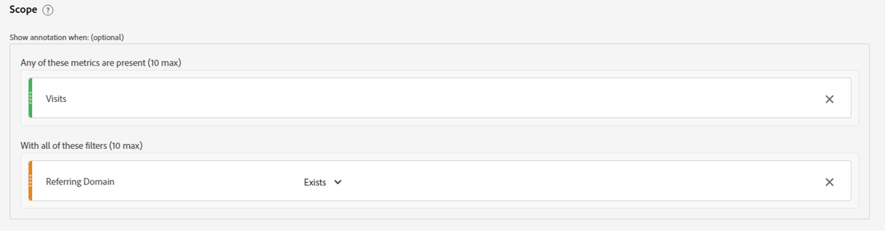

# Desbloquear la perspectiva analítica; aprovechar el poder de las anotaciones

El componente de datos Anotaciones es uno de los más sencillos, pero a largo plazo, una de las funcionalidades que más tiempo ahorran en Adobe Analysis Workspace. A diferencia de cualquier otra funcionalidad de Workspace, sirve como memoria histórica narrativa para usted y los demás usuarios de Workspace.

En pocas palabras, las anotaciones son textos de descripción cortos que se pueden agregar a los datos de tendencias de fecha dentro de Adobe Workspace. Las anotaciones ofrecen contexto a todos los que utilizan Analysis Workspace para comprender el historial de datos de su empresa, ayuda a analizar el rendimiento más rápidamente y proporciona a todos los informes una sensación altamente personalizada.

## Casos de uso

Hay varias situaciones en las que las anotaciones son especialmente útiles:

- **Valores periféricos (picos y valle)**: si conoce la razón de los picos y mínimos principales de los datos de tendencias, haga clic con el botón secundario del mouse (ratón) en el punto de datos periféricos y elija &quot;Anotar selección&quot; para compartir ese conocimiento con todos.

- **Campañas y pruebas de marketing principales**: como campañas y pruebas de marketing (A/B, multivariable, etc.) puede afectar directamente al tráfico y al rendimiento, y es una ventaja sencilla para todos documentar el periodo de tiempo de esas campañas y pruebas en Anotaciones.

- **Factores y eventos externos**: desde eventos importantes que ocurren una sola vez, hasta acciones de la competencia, nuevas versiones de productos y eventos globales o nacionales relevantes, asegúrese de agregar a las anotaciones cualquier factor externo relevante para los datos.

- **Brechas y errores**: debería usar la característica Alertas para avisarle de posibles problemas de recopilación de datos, pero incluso el equipo con más experiencia lamentablemente experimenta algún tipo de error de recopilación de datos o lagunas temporales de vez en cuando. Las anotaciones son una buena manera de minimizar el impacto, ya que permiten a los usuarios saber que los datos faltan o están incompletos.

## Instrucciones

Crear y editar anotaciones es intuitivo y casi autoexplicativo. Haga clic con el botón derecho en un punto de datos dentro de una visualización de tendencias de fecha o una tabla de forma libre y elija &quot;Anotar selección&quot; para crear una anotación o utilice la navegación principal a &quot;Componentes > Anotaciones&quot; para crear y editar anotaciones.

{width="70%"}{width="30%"}

Para ver todos los detalles de cómo funcionan las anotaciones, asegúrate de ver el [tutorial en vídeo sobre el Experience League](https://experienceleague.adobe.com/es/docs/analytics-learn/tutorials/analysis-workspace/navigating-workspace-projects/annotations-in-analysis-workspace).

## Sugerencias y trucos para empezar

Por último, aquí hay algunos consejos útiles para empezar a utilizar las anotaciones de inmediato.  El uso de estas sugerencias ayudará a que sus anotaciones sean efectivas, claras e informativas para todos los usuarios.

- **Codificación de color**: la característica Anotaciones le permite seleccionar entre una amplia gama de colores, que aparecen dentro de sus proyectos de Workspace para ayudarle a diferenciar entre varios tipos de Anotaciones. Si mide varios sitios o aplicaciones diferentes, puede elegir un color diferente para cada uno. O quizás un color diferente para cada categoría de anotaciones.

- **Etiquetado de títulos**: una manera adicional de dar a los usuarios indicaciones visuales sencillas con respecto a una anotación es etiquetar el título de la anotación. Al igual que con la codificación por colores, puede elegir diferentes etiquetas según la estructura de los datos de su organización, por ejemplo, por canal o nombre (por ejemplo, WEB, APP o ALL)

- **Ámbito**: al crear una anotación, tiene a su disposición toda la gama de dimensiones, métricas y limitadores para mostrar las anotaciones en el contexto adecuado. Algunas anotaciones solo son relevantes para determinadas dimensiones o métricas, por lo que puede limitar cuándo se muestra una anotación a la dimensión o métrica correspondiente.

- **Guardar como**: una vez que haya creado una o dos anotaciones, puede volver a utilizarlas como plantillas para crear nuevas anotaciones, utilizando la opción &quot;Guardar como&quot;, que ahorra tiempo.

- **Administrador de anotaciones**: utilice la navegación principal a &quot;Componentes > Anotaciones&quot; para llegar al Administrador de anotaciones, donde encontrará funcionalidades más amplias para crear y, especialmente, editar anotaciones.

- **Permisos -** Si no tiene la capacidad de crear anotaciones, póngase en contacto con el administrador que puede permitir la &quot;Creación de anotaciones&quot; en el Admin Console.

Para obtener documentación detallada, visite [Información general sobre anotaciones](https://experienceleague.adobe.com/es/docs/analytics/analyze/analysis-workspace/components/annotations/overview) y artículos relacionados.

## Autor

Este documento fue escrito por:

Thomas Edward Buckley, Data Warehouse y Business Intelligence de Miles &amp; More (Grupo Lufthansa)
