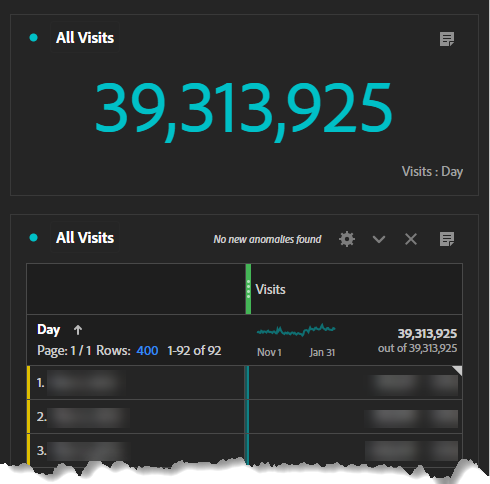

# Generación de segmentos de Customer Recorrido

Aprenda a crear segmentos de recorrido de clientes basados en el comportamiento en [!DNL Adobe Analytics] y a mejorar la experiencia de sus clientes con el Experience Cloud de [!DNL Adobe] siguiendo esta guía paso a paso.

Vamos a crear mejores segmentos de recorrido del cliente. En esta serie, usaremos [!DNL Adobe Analytics] para definir segmentos basados en el comportamiento, estimar el tamaño de la audiencia y rastrear el movimiento del usuario. Al final, podrás personalizar el contenido y mejorar la experiencia de tus clientes con el Experience Cloud [!DNL Adobe]. Tenga en cuenta que estos segmentos están activos y deben actualizarse a medida que obtenga más información sobre sus clientes. Aunque los informes pueden presentar algunos desafíos, no se preocupe, ¡le guiaré a través de ellos! Empecemos creando nuestro primer conjunto de segmentos de Recorrido del cliente, empezando por el segmento &quot;One Hit Wonders&quot;.

Hoy crearemos marcadores de posición para nuestro primer conjunto de segmentos de Recorrido de clientes, crearemos un Workspace de [!DNL Adobe Analytics] que nos ayudará a definir nuestros segmentos y nuestro primer segmento, &quot;One Hit Wonders&quot;.

Al final de esta serie, podrá crear segmentos de recorrido de clientes en [!DNL Adobe Analytics] basados en señales de comportamiento. Podrá estimar el tamaño de cada audiencia en cada fase del recorrido y comprender a qué velocidad se mueven los usuarios entre esas fases. Y podrá exportar esas audiencias de recorrido del cliente al Experience Cloud [!DNL Adobe] para habilitar la personalización y la segmentación de medios.

Cada negocio es diferente, lo que significa que los segmentos de recorrido de los clientes se verán diferentes a los míos. Por lo tanto, en lugar de prescribir fórmulas específicas para sus segmentos, sugiera algunas cosas que ver y un proceso general para crearlas.

También es importante tener en cuenta que los segmentos de recorrido de los clientes serán segmentos activos. Este no es un ejercicio de una sola vez. A medida que obtenga más información sobre sus clientes, actualizará estos segmentos. Esto presenta algunos desafíos para la creación de informes. La gente quiere coherencia en sus informes y, si nuestras definiciones de segmentos cambian, los números de los informes también cambiarán.

## Introducción a los segmentos por intención de visita

El primer paso para crear segmentos de recorrido del cliente es deducir por qué un invitado está en su sitio web utilizando señales de comportamiento y, si están disponibles, datos de la Voz del cliente. Generaremos un conjunto de segmentos de intención de visita para categorizar todas las visitas del sitio web. En este punto, los segmentos por intención de visita deben ser mutuamente excluyentes y completamente exhaustivos. Cada visita debe pertenecer a un segmento, y solo a uno, de intención de visita.

Los segmentos por intención de visita describen una visita, por lo que utilizaremos el contenedor de visitas en la definición del segmento.

Mi conjunto inicial de segmentos por intención de visita incluía lo siguiente:

* One Hit Wonders
* Sensibilización
* Consideración
* Reserva (compra)
* Retención (Gestionar una reserva/compra)

Para facilitar el uso de los segmentos por intención de visita, añadí a mis nombres de segmento el prefijo &quot;Intent:&quot;, les di un número para habilitar la ordenación y los etiqueté como &quot;Intent&quot;. Mis segmentos se parecían a la imagen siguiente.

**Continúe y cree los segmentos por intención de visita usando el contenedor de visitas con una definición de marcador de posición de Vistas de página >= 1.**

Como veremos, la creación de estos segmentos es un proceso iterativo e interconectado. Describiré el proceso de creación de estos segmentos en un post futuro.

## Workspace de calidad de datos del segmento por intención de visita

Utilicé un espacio de trabajo sencillo para asegurarme de estar definiendo bien los segmentos por intención de visita. Recuerde, cada visita debe pertenecer a un segmento, y solo a uno, de intención de visita. El espacio de trabajo que configuré garantiza que todas las visitas se contabilicen y que no haya superposición entre los segmentos.

He denominado este espacio de trabajo &quot;CALIDAD DE LOS DATOS: Segmentos por intención de visita&quot; con las etiquetas &quot;calidad de los datos&quot;, &quot;intención de visita&quot; y &quot;recorrido del cliente&quot;. Más adelante, crearemos un &quot;Tablero de visitas por intención&quot;, de modo que el prefijo &quot;CALIDAD DE LOS DATOS&quot; indique que este espacio de trabajo se utiliza para configurar y mantener los segmentos. Es un tablero administrativo que tiene bastante poco conocimiento del negocio, pero es importante para garantizar que los segmentos se mantengan. Es aconsejable volver a este panel o configurar alertas de forma rutinaria para asegurarse de que los segmentos se definen correctamente.

La visualización más importante en este espacio de trabajo es la Visualización de forma libre de superposición de segmentos en el centro izquierdo. Con la métrica Visitas, cree filtros de columna para cada uno de los segmentos por intención de visita, además del segmento Todas las visitas en la columna más a la derecha. Cree filas para cada segmento de intención de visita a la izquierda. Ahora tendrá una visualización entre pestañas. Cuando los segmentos están correctamente configurados, solo habrá datos en una columna y una fila en la intersección de cada segmento de intención de visita consigo mismo.

Las siguientes visualizaciones más importantes son las métricas de resumen en la parte superior izquierda. El resumen de visitas segmentadas toma su valor de la columna Todas las visitas en la visualización Superposición de segmentos inmediatamente inferior. El resumen de todas las visitas tiene su propia tabla oculta.

En la parte superior derecha, he agregado métricas adicionales a cada uno de los segmentos para dar algo de &quot;sabor&quot; a cómo se están formando los segmentos. En particular, como estos segmentos se excluyen mutuamente, solo espero ver reservas para el segmento Calidad de reserva (no se preocupe, llegaremos a tasas de conversión cuando hagamos que estos segmentos Calidad de visita estén basados en visitantes.

Recuerde que acabamos de crear segmentos de marcador de posición. Por lo tanto, inicialmente, su espacio de trabajo se verá débil. Todos los segmentos por intención de visita se superpondrán al 100 % porque tienen la misma definición. Esto es correcto, y exactamente lo que desea ver en este punto del proceso. A medida que creamos las definiciones de segmentos, verá que estos empiezan a tomar forma.

## Creación del segmento por intención de primera visita

Definir segmentos por intención de visita es un proceso de eliminación y existe una gran interdependencia entre ellos. Así que no construí estos segmentos en el orden del recorrido, los construí en orden desde el más fácil de definir hasta el más desafiante. Eso me dio esta orden:

1. Intención: 0 - Una visita maravillas
1. Intención: 3 - Reserva
1. Intención: 4 - Retención
1. Intención: 2 - Consideración
1. Intención: 1 - Conocimiento

Bastante aleatorio, ¿eh? La definición de estos segmentos por intención de visita fue un proceso iterativo, de ida y vuelta, y a menudo un ajuste en un segmento que requería actualizaciones para otros segmentos. Esto se hará más claro a medida que describa cómo definí cada uno de estos segmentos.

Hoy definiremos nuestro primer segmento, el más sencillo, Maravillas de One Hit

## Creación del segmento Maravillas de una visita

Mi primer segmento, &quot;One Hit Wonders&quot;, fue fácil de definir. Es simplemente cualquier visita con una sola vista de página. Realmente no sabemos por qué ese usuario estaba en el sitio web, porque rebotó. Supongo que podríamos adivinar una intención basada en su página de entrada, pero con solo una vista de página, no hay suficiente información para hacer una suposición informada sobre la intención.

Después de definir este segmento, empezará a ver cómo cobra forma su Workspace por intención de visita.

Generar segmentos de recorrido de clientes usando [!DNL Adobe Analytics] es un proceso desafiante pero gratificante. Al crear segmentos basados en el comportamiento, estimar el tamaño de la audiencia y rastrear los movimientos de los usuarios, las empresas pueden personalizar los medios y mejorar la experiencia del cliente. Cada negocio es único y no hay fórmulas específicas para crear segmentos, sino directrices y un proceso a seguir. Los segmentos deben actualizarse a medida que las empresas obtengan más información sobre sus clientes, lo que presenta desafíos para la creación de informes. Al seguir el proceso de creación de segmentos de intención de visita, las empresas pueden mejorar la experiencia general del cliente.

## Autor

Este documento fue escrito por:

**Aaron Fossum**, Director, Digital [!DNL Analytics]

[!DNL Adobe Analytics] campeón
