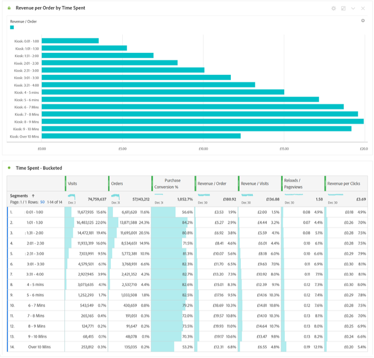

# Espere un segmento... Use segmentos para descubrir nuevas perspectivas en Analysis Workspace

Si es usted un nuevo [!DNL Adobe Analytics] Usuario o profesional experimentado, aprovechará bastante los segmentos en sus proyectos de Analysis Workspace. Como [[!DNL Adobe] Experience League](https://experienceleague.adobe.com/docs/analytics/components/segmentation/seg-overview.html?lang=es) En, se describe como &quot;los segmentos le permiten identificar subconjuntos de visitantes basándose en sus características o en las interacciones con el sitio web&quot;. Aunque el resultado básico de esta función es aislar grupos de usuarios, visitas o visitas individuales a su sitio, un analista agudo como usted puede ser creativo con esta herramienta y encontrar nuevas formas de obtener información sobre la actividad del sitio. La lista de opciones posibles es amplia, así que no dude en crear la suya propia y compartirla con otros de su organización o en línea en comunidades como la [[!DNL Adobe Analytics] Comunidad](https://experienceleaguecommunities.adobe.com/t5/adobe-analytics/ct-p/adobe-analytics-community?profile.language=es) en el Experience League o en [#Measure Slack](https://www.measure.chat/) comunidad.

Si necesita un repaso rápido sobre cómo crear un segmento, consulte la documentación de Experience League sobre el uso del [Generador de segmentos](https://experienceleague.adobe.com/docs/analytics/components/segmentation/segmentation-workflow/seg-build.html?lang=en) en Analysis Workspace.

## Comparación y contraste de segmentos

En Analysis Workspace puede comparar dos segmentos utilizando &quot;[Comparación de segmentos](https://experienceleague.adobe.com/docs/analytics/analyze/analysis-workspace/panels/segment-comparison/segment-comparison.html?lang=es)&quot;. La comparación de segmentos se puede encontrar en la sección Paneles de la barra de navegación izquierda:

Sin embargo, a veces no necesita un panel de comparación completo para ofrecer perspectivas clave a los usuarios finales. Afortunadamente, algunas funciones también se pueden comparar en un panel estándar.

El [Visualización de diagrama de Venn](https://experienceleague.adobe.com/docs/analytics/analyze/analysis-workspace/visualizations/venn.html?lang=es) puede ayudar a crear una comparación rápida, lo que le permite pasar el ratón por encima y ver las sesiones, pedidos, usuarios, etc. que se superponen. entre 2 y 3 segmentos personalizados. También puede generar segmentos rápidamente haciendo clic con el botón derecho en cualquiera de las secciones superpuestas:

A veces, la información importante no se encuentra en los datos superpuestos, sino en los datos que no se superponen. Una forma rápida de ver esto es crear una copia de un segmento y convertirlo en un segmento de &quot;Exclusión&quot;:

Al apilar el segmento de exclusión con el otro segmento de la comparación, ahora puede calcular rápidamente cuántas visitas llegan a la página del menú sin ver también la página de inicio en la misma sesión:

## Ataque de pila

Del mismo modo, puede crear los datos de intersección de un diagrama de Venn simplemente apilando cualquier segmento. No hay límite en cuanto a la cantidad de segmentos o dimensiones individuales que se apilan. Por ejemplo, si quisiera averiguar rápidamente qué días de la semana del mes pasado mi sitio tuvo una visita en un teléfono móvil, específicamente un Samsung Galaxy A52, que sí vio mis páginas de menú y nutrición, pero NO vio mi página de inicio, puedo construirlo rápidamente sobre la marcha de esta manera:

Pero aún mejor, una vez que encuentro ese subconjunto perfecto de mi base de usuarios o visitas, puedo seleccionar todos esos valores, hacer clic con el botón derecho y crear un segmento al instante:

Eso es mucho poder en un segmento.

## Un segmento de números para una serie de segmentos

Muchos usuarios suelen observar los valores nominales, ordinales o de intervalo al crear segmentos, como una página visitada, un intervalo de edad de usuarios o el número de visitas que un usuario ha realizado en el pasado. Sin embargo, también puede utilizar datos de proporción al crear un segmento agrupando estos valores, ya sean dimensiones estándar, métricas estándar o variables y métricas personalizadas para su organización.

Por ejemplo, Tiempo empleado en la página o Tiempo empleado por visita tiene bloques creados previamente:

Sin embargo, es posible que no siempre se ajusten a las necesidades de su organización; tal vez la mayoría de las visitas al sitio sean de menos de 10 minutos. Puede utilizar la medición granular para crear bloques de distinto tamaño. Este es un informe creado para observar las visitas que duran entre 1 minuto, 1 segundo y 1 minuto, 30 segundos:

Una vez creada, ahora puedo empezar a ver mis visitas, pedidos y otros eventos por los diferentes grupos de tiempo agrupados que he personalizado:

Incluso puede empezar a examinar cómo cambian los Indicadores clave de rendimiento (KPI) como factor de cuánto tiempo invierte un usuario, cuántas páginas visita en una visita, cuántas veces ha visitado en el pasado o cualquier otro valor numérico, lo que básicamente le permite ver una métrica como factor de otra métrica:

Las posibilidades de usar segmentos para encontrar nuevas perspectivas son infinitas. Esto es simplemente un punto de partida. Pruebe algunas por su cuenta y haga saber a la comunidad lo que descubre: [[!DNL Adobe Analytics] Comunidad](https://experienceleaguecommunities.adobe.com/t5/adobe-analytics/ct-p/adobe-analytics-community?profile.language=es) en el Experience League o en [#Measure Slack](https://www.measure.chat/) comunidad.

¡Feliz segmentación!

## Autor

Este documento fue escrito por:

**Dan Cummings**, Sr. Ingeniería de productos [!DNL Analytics] Gerente en McDonald&#39;s Corporation

[!DNL Adobe Analytics] Campeona
