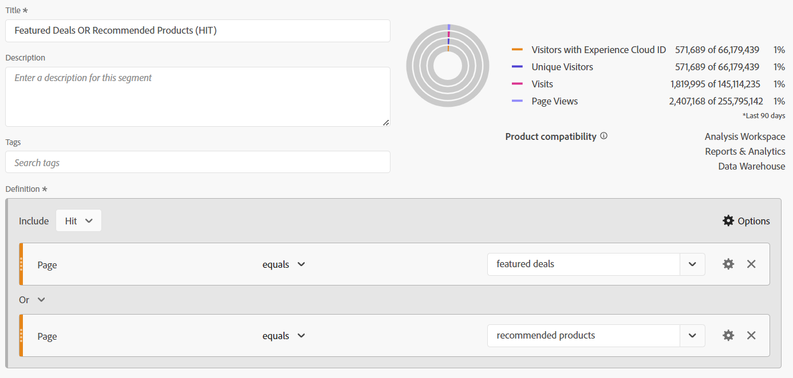

# La magia detrás de la cortina: Segmentos complejos: exclusiones, contenedores y atribución

_Descubra las complejidades de la segmentación de datos compleja, explorando exclusiones, contenedores y modelos de atribución. Al igual que el juego de manos de un mago, dominar estas técnicas permite a los analistas realizar magia de datos, transformando las perspectivas con precisión y delicadeza._

Las cortinas están abiertas, el escenario está listo... esto puede no ser un acto de magia de Las Vegas, pero podemos realizar algunos trucos bastante sorprendentes al construir nuestros segmentos.

Dentro de este módulo cubriremos:

- Excluir lógica
- Uso de contenedores
- Modelo de atribución

## Incluir frente a excluir

De forma predeterminada, todos los contenedores comienzan como **include** , lo que básicamente significa que devuelven datos que coinciden con los criterios. Sin embargo, también puede cambiar el segmento o los contenedores dentro de los segmentos para que **excluir** , lo que le permite rechazar determinados criterios.

Si bien un mago puede encontrar tu carta en la baraja, es increíble cuando ese mago puede hacer que el resto de la baraja no exista. Del mismo modo, en los segmentos de exclusión, queremos que los datos no deseados simplemente desaparezcan de nuestro conjunto de datos.

Podrían estar sentados pensando, &quot;Ok, pero ya tengo las opciones &#39;No es igual&#39; y &#39;No contiene&#39;, ¿no debería cubrirme?&quot; Desafortunadamente, la respuesta a eso es no... y no se trata solo de poder excluir grupos de lógica, sobre un solo elemento. Incluso cuando se trata de un solo componente, a menudo tendrá que utilizar *excluye* para lograr su objetivo.

- **No contiene / No es igual a** - Es exactamente lo que suena, que coincide con los elementos que no contienen una cadena específica
- **Excluir: el valor contiene / es igual a** - Esto hará que *excluir* elementos que coinciden con la cadena

A primera vista, ambos suenan igual... y así sucesivamente **Visita** Nivele los segmentos o contenedores, sería correcto, ya que realizarán la misma acción. Sin embargo, al utilizar **visita** o **visitante** alcance obtendrá resultados muy diferentes.

**Figura 1: No contiene / no es igual a: ámbito de la visita**

*Tenga en cuenta que cada visita individual devuelve un valor true o false y que esos valores se invierten entre no y excluye.*

- No contiene &quot;Value&quot; (Sí), por lo tanto devuelve true e incluye esa visita; del mismo modo, no contiene &quot;Example&quot; (no, lo contiene), por lo tanto devuelve false y no incluye esa visita. Básicamente, devuelva cualquier dato que devuelva un resultado verdadero.
- Si &quot;Value&quot; contiene &quot;Example&quot; (no) y, por lo tanto, devuelve false y no excluye esa visita; del mismo modo, si &quot;Example&quot; contiene &quot;Example&quot; (sí) y, por lo tanto, devuelve true y excluye esa visita. Básicamente, devuelve datos que sí lo hacen **no** tenga un resultado verdadero o devuelva datos que sean falsos según sus criterios.
- Se puede ver en el **Visita** nivel, ambos conjuntos de lógica devolverán el mismo conjunto de datos.

**Figura 2: No contiene / no es igual a: ámbito de la visita**

*Como arriba, cada visita individual dentro de **visita**se evaluarán con el mismo valor true / false. Sin embargo, el conjunto de datos que se devuelve es el de toda la visita.*

- En cada visita individual, &quot;Value&quot; no contiene &quot;Example&quot; (sí), por lo que devuelve el valor &quot;True&quot;; del mismo modo, no contiene &quot;Example&quot; (no, lo contiene), por lo que devuelve el valor &quot;False&quot;.
   - If **cualquiera** la visita individual en la visita devuelve **true** y, a continuación, el **toda la visita** se devuelve.*
   - Si la visita estaba compuesta únicamente por visitas que contenían &quot;Ejemplo&quot;, entonces ninguna visita devolvería el valor &quot;True&quot; y, por lo tanto, esa visita sí lo haría **no se puede devolver** en el conjunto de datos.
- De nuevo, en cada visita individual el &quot;Ejemplo&quot; contiene &quot;Ejemplo&quot; (sí), por lo que devuelve el valor &quot;True&quot;
   - If **cualquier visita** devoluciones **true**, toda la visita será **excluido**
   - If **todas las visitas** en la devolución de la visita **false**, esa visita se devolverá en el conjunto de datos
- Ahora pueden ver dónde esta lógica empieza a divergir. En el ejemplo anterior hay tres visitas distintas:
   - Cuando se utiliza &quot;No contiene / Igual a&quot; **dos de los tres** se devolverán las visitas.
   - Cuando se utiliza &quot;Excluir contiene / es igual a&quot; **solo uno** de esas visitas se devolverán

**Figura 3: No contiene / no es igual a: ámbito de la visita**

*Como en el caso anterior, cada visita realizada por el **visitante**se evaluarán con la misma lógica true / false. Pero ahora estamos viendo todas las visitas que este visitante ha realizado, en todas las visitas (dentro del intervalo de fechas seleccionado).*

- En cada visita individual, &quot;Value&quot; no contiene &quot;Example&quot; (sí), por lo que devuelve el valor &quot;True&quot;; del mismo modo, no contiene &quot;Example&quot; (no, lo contiene), por lo que devuelve el valor &quot;False&quot;.
   - If **cualquiera** la visita realizada por el visitante devuelve **true** y, a continuación, el **toda la visita** se devuelve.
   - Si el visitante nunca realizó ninguna visita que contuviera &quot;Ejemplo&quot;, entonces ninguna visita devolvería el valor &quot;True&quot; y, por lo tanto, ese visitante sí lo haría **no se puede devolver** en el conjunto de datos.
- De nuevo, en cada visita individual el &quot;Ejemplo&quot; contiene &quot;Ejemplo&quot; (sí), por lo que devuelve el valor &quot;True&quot;.
   - If **cualquier visita** devoluciones **true**, todo el visitante (y posteriormente todas sus visitas) se **excluido.**
   - If **todas las visitas** en la devolución de la visita **false**, ese visitante se devolverá en el conjunto de datos, por lo que se devolverá con éxito a los visitantes que no hayan hecho &quot;X&quot;.
- Esta es una extensión de la lógica de visita, donde hay incluso más consideraciones. En el ejemplo anterior hay dos visitantes diferentes, con 3 visitas cada uno:
   - Cuando se utiliza &quot;No contiene / Igual a&quot; **ambos** se devolverán los visitantes, al igual que todos los **tres** de sus visitas (que representan 2 visitantes y 6 visitas totales en sus informes)
   - Cuando se utiliza &quot;Excluir contiene / es igual a&quot; **solo uno** de esos visitantes se devolverán y solo se incluirán las tres visitas asociadas a ese visitante (que representan 1 visitante y 3 visitas totales en sus informes)

>[!TIP]
>
>Esta lógica puede ser compleja, especialmente cuando comienza a anidar contenedores... siempre es buena idea realizar pruebas con datos de muestra controlados para asegurarse de que el segmento devuelva los datos que cree que debería.

### Ejemplo de segmento 1: Excluir las visitas que realizan una compra

En este ejemplo, quiero segmentar usuarios que llegaron a un sitio y lo hicieron *no* realizar una compra durante su visita (básicamente, quiero excluir las visitas que realizaron una transacción; por lo tanto, me quedaré con las visitas que no completaron una transacción)

Para comparar, veamos un segmento que se ha creado con &quot;No existe&quot;:

Observe cómo la vista previa muestra un resultado muy diferente. De hecho, este segmento devolverá el 100 % de mis visitas, ya que cada visita tiene al menos una visita que no incluye la métrica &quot;Pedido&quot;.

Para ilustrar esto más adelante, vamos a comparar los dos segmentos en paralelo:

En primer lugar, se puede ver que a pesar de la *visita* A nivel de ámbito del segmento, podemos emparejarlo con otras métricas (como vistas de página o visitantes únicos). El primer conjunto de columnas está sin segmentar, para mostrar de un vistazo que un segmento (no existe) devuelve casi el 100 % de los datos, solo el segmento de exclusión hace lo que necesitamos que haga.

La columna más destacable son los pedidos, que deberían ser inmediatamente obvios de que el contenedor &quot;No existe&quot; es incorrecto, ya que la mayoría de los pedidos aún se están devolviendo.

### Ejemplo de segmento 2: Excluir visitantes que han realizado una compra dentro del periodo del informe

En este ejemplo, quiero utilizar las ideas de la muestra anterior (que miraba específicamente en el nivel de visita) y expandirla para encontrar los visitantes que no han realizado una compra en el lapso de tiempo de mi informe.

Este segmento será muy similar al ejemplo anterior, casi idéntico, pero el ámbito del segmento va a marcar una gran diferencia.

Ahora, si comparamos el segmento con ámbito de visitante con el segmento con ámbito de visita anterior, verá que se excluyen muchos más datos y muchas más visitas, ya que *visitantes que han realizado compras* también tenía visitas en las que no se realizó ninguna compra y, por lo tanto, esas visitas también se excluyen, ya que forman parte del ciclo de vida del visitante.

>[!IMPORTANT]
>
>Cuando se buscan datos con ámbito de visitante, cuanto más largo sea el lapso de tiempo del informe, mayor será la exclusión, ya que muchos visitantes serán visitantes fieles que regresan al sitio (por supuesto, algunos modelos comerciales verán un impacto mayor que otros)

>[!IMPORTANT]
>
>Aunque las diferencias entre la visita y el visitante pueden ser *sutil* (especialmente en estos datos de ejemplo), son lógicas únicas que deben tenerse en cuenta. Los datos pueden ser sorprendentemente diferentes según el sitio y los comportamientos de los usuarios.

Es importante saber exactamente qué datos o qué *historia*, está intentando decirlo con su informe. Garantizar que las tablas y visualizaciones indiquen claramente a la audiencia ***qué*** se está mostrando y el uso del modelo de segmento adecuado es fundamental para realizar el análisis adecuado. Las decisiones informadas solo se pueden tomar correctamente si todos entienden lo que están viendo.

## Uso de contenedores

Los contenedores nos proporcionan la capacidad de crear &quot;sublógica&quot; dentro de la lógica principal del segmento y una idea errónea común es que el ámbito debe ser el mismo entre el segmento y el contenedor... pero no es así. Esto nos da más libertad para crear escenarios específicos en el mayor esquema de las cosas, para construir lógicas complejas.

La mejor manera de pensar en los contenedores es imaginar que cada contenedor es una caja, y que podemos apilar cajas (de lógica) dentro de otra caja, dentro de otra caja... pero a diferencia de las cajas físicas donde cada caja debe ser más pequeña que la caja exterior, podemos poner algo más grande dentro si eso nos impulsa a recuperar los datos correctos. Piensen en ello como en un sombrero de mago, donde lo imposible cabe dentro y nosotros somos los magos de los datos...

### Ámbito de los contenedores

Primero vamos a hacer un desglose rápido de *contenedor* ámbito. Like *segmento s* hacer frente, usted tiene su básico **Visita**, **visita** y **visitante** opciones de ámbito, pero a veces también verá algo llamado **grupo lógico** en lugar de visitante (esto solo ocurrirá en segmentos secuenciales y se tratarán en el artículo siguiente).

Puede añadir contenedores dentro de su segmento (o dentro de otros contenedores) accediendo al **opciones*** (cuando anide varios elementos, tenga cuidado de agregar al bloque correcto, aunque afortunadamente puede arrastrar y soltar contenedores dentro de la interfaz si lo agrega a la ubicación incorrecta)

**Figura 1: Adición de un contenedor**

El alcance de un contenedor es independiente del padre, como mencioné anteriormente, estos *no* Tienes que coincidir, y dependiendo de lo que quieras devolver, es posible que tengas que dibujar el plan para visualizar completamente lo que necesitas, al menos hasta que te sientas cómodo visualizándolo en tu cabeza.

**Figura 2: Ámbito del segmento vs. ámbito del contenedor**

>[!NOTE]
>
>El Adobe tiene lógica para comprender segmentos válidos y no válidos, no le proporcionarían opciones que podrían *nunca* funciona... por lo que si ve la opción de usar un contenedor con ámbito de visitante dentro de un segmento con ámbito de visita, significa que es una opción válida.

Al igual que para los segmentos básicos, cuando comienza a generar un segmento complejo con contenedores anidados, debe tener una idea clara sobre lo siguiente ***qué*** tipo de datos que desea que se devuelvan. ***Cómo*** ¿planea usar esos datos? ***Que*** métricas ¿planea emparejar con el segmento?

Estas preguntas ayudarán a determinar cuál será el ámbito del segmento en su conjunto, este es el punto de partida para cualquier segmento.

El hecho de que planee emparejar un segmento con su métrica de visitantes únicos no significa que el propio segmento deba ser de nivel de visitante... muy diferente. Un segmento de nivel de visitante devolverá todos los datos de un visitante... esto significa todas sus visitas, todas sus vistas de página, etc. Una vez que un visitante coincida con los criterios del segmento, el segmento podría empezar a devolver datos del *pasado* para este visitante (siempre que esté dentro del intervalo de fechas del espacio de trabajo).

>[!IMPORTANT]
>
>Incluso cuando planea emparejar un segmento con la métrica de visitantes únicos, esto *no significa* que el segmento debe estar automáticamente dentro del ámbito del visitante... Esta idea errónea *podría* crear resultados inflados e incorrectos.

Por lo tanto, he hablado mucho sobre los conceptos de cómo seleccionar el ámbito adecuado, pero no he proporcionado ejemplos o detalles específicos que realmente le ayudarán... así que vamos a profundizar en eso ahora con algunos ejemplos de casos de uso reales. Dicen que un mago nunca revela sus secretos, pero eso no es del todo cierto. Dentro del mundo mágico, las técnicas y los trabajos &quot;detrás de la cortina&quot; a menudo se comparten con compañeros, permitiéndoles construir y mejorar la ilusión, y eso es lo que intento hacer... para abrir la puerta a las posibilidades que les esperan.

### Ejemplo de segmento 3: Vistas de páginas específicas de visitantes que han realizado un pedido reciente (dentro del período de informe)

En este caso, solo deseo devolver un conjunto de páginas específicas que han sido visitadas por compradores recientes (tenga en cuenta que aún puedo emparejar esto con visitas o visitantes únicos, aunque el segmento en sí mismo se encuentre en el ámbito de VISITA INDIVIDUAL).

Este tipo de escenario es bueno para ver si tengo compradores que buscan páginas específicas en un sitio o páginas que pueden no estar conectadas explícitamente a un evento específico.

Mi ejemplo es ir a las páginas de &quot;Ofertas destacadas&quot; y &quot;Productos recomendados&quot;. Actualmente, vamos a mantener la lógica simple y no entrar en la segmentación secuencial (al menos aún no, pero abordaremos una lógica más compleja como esa en un artículo futuro).

Otra pregunta es **por qué** ¿estamos retrocediendo por los golpes? Técnicamente, podría pasar por Visitas o Visitantes aquí, pero también puedo ver estas páginas específicas de la siguiente manera **vistas de página (para el conjunto de páginas específico) por visita** o **vistas de página (para el conjunto específico) por visitante** Sin embargo, este ámbito me da la flexibilidad para realizar esta matemática específica. Dado que estas visitas se pueden asociar fácilmente con visitas o visitantes únicos para determinar el número de visitas o visitantes que ven estas páginas, optaré por el segmento más flexible que pueda utilizar para todos los escenarios.

En primer lugar, para comparar, le presentamos un segmento simple basado en VISITAS para las páginas específicas.

Ahora, vamos a construir en la complejidad:

Observarán que no sólo utilizo varios contenedores, sino que estoy mezclando el ámbito de esos contenedores. El segmento en su conjunto está en el nivel de VISITA INDIVIDUAL, pero también busco VISITANTES que hayan realizado un pedido.

Vamos a pasar un poco de tiempo para desempaquetar esto, ya que hay mucho que hacer.

En primer lugar, en lugar de mostrar un desglose diario, estoy mostrando un desglose de página, ya que creo que esto ayudará a ilustrar mejor los dos segmentos.

<table style="border: 0;">
    <tr>
        <td width="352" style="border: 0;">Las tres primeras columnas (Vistas de página, visitas y visitantes únicos) no están segmentadas y, por lo tanto, muestran todas las páginas del sitio. Tenga en cuenta que no he incluido pedidos aquí, ya que los pedidos se rastrean en una acción y, por lo tanto, no forman parte del ámbito de la dimensión de página.</td>
        <td style="border: 0;">&lt;img src="assets/segment-example-3/segment3c-comparison-table-detail1.png" width="352"
        </td>
    </tr>
</table>

<table style="border: 0;">
    <tr>
        <td width="352" style="border: 0;">A continuación, se muestra el resultado del segmento simple, mirando únicamente <strong>visitas</strong> en las dos páginas especificadas. Observará que las demás páginas del desglose resultan en 0, tal como se espera.</td>
        <td style="border: 0;">&lt;img src="assets/segment-example-3/segment3c-comparison-table-detail2.png" width="352"
        </td>
    </tr>
</table>

<table style="border: 0;">
    <tr>
        <td width="352" style="border: 0;">Ahora, aquí hay un pequeño consejo adicional, antes de mostrar el resultado del segmento avanzado, utilicé otro segmento simple de "Pedidos existen" (en un ámbito de nivel de VISITA), y lo emparejé con visitantes únicos. Esto me devolverá el total de UV que hicieron pedidos en mi período de informe, así como los UV que tocaron cada una de esas páginas... esto ayudará a ilustrar mejor el siguiente conjunto de columnas.</td>
        <td style="border: 0;">&lt;img src="assets/segment-example-3/segment3c-comparison-table-detail3.png" width="352"
        </td>
    </tr>
</table>

<table style="border: 0;">
    <tr>
        <td width="352" style="border: 0;">El conjunto final de columnas se apilan con mi segmento complejo. Los UV generales con pedidos coinciden con el segmento simple "Pedidos existen" en cada página, pero notará que el total es significativamente diferente; ya que este conjunto de datos restringe explícitamente el conjunto de datos solo a los visitantes que realizaron pedidos Y visitaron las páginas, estoy explícitamente interesado en.</td> <td style="border: 0;">
        </td>
    </tr>
</table>

### Ejemplo de segmento 4: Visitas que visitan ofertas destacadas O productos recomendados Y realizan un pedido dentro de la misma visita

El ejemplo anterior muestra cómo se puede agregar un contenedor de ámbito mayor (es decir, visitante) dentro de un contenedor de ámbito más pequeño (es decir, una visita individual para que no sea de extrañar que se puedan agregar contenedores de visita individual dentro de segmentos con ámbito de visitante o visita.

Usando algunas de las mismas páginas que estábamos viendo anteriormente, ahora solo nos importa recuperar a los visitantes que visitaron las ofertas destacadas O la página de productos recomendados Y realizaron un pedido en la misma visita.

Este segmento combina los tres ámbitos. El nivel superior del segmento es visitante, por lo que se asegurará de que se devuelvan TODAS las visitas de todas las visitas del visitante coincidente. Dentro de él, hemos agregado un contenedor de ámbito de visita, que va a garantizar que el visitante debe haber tenido al menos una visita que coincida con los criterios específicos de hacer un pedido Y haber visitado páginas específicas. Hemos agregado un contenedor de ámbito de visita para las propias páginas, de modo que podemos utilizar la lógica OR para buscar la página de ofertas destacadas O la página de productos recomendados.

La ventaja para este segmento con ámbito de visitante es que devolverá **TODO** las visitas de los visitantes que cumplan este criterio, por lo que este segmento será bueno si quiero ver los comportamientos de las visitas anteriores que preceden a esta combinación y las acciones de estos visitantes tras un escenario de este tipo.

Aquí estoy comparando las visitas en ofertas destacadas/contenido recomendado, con los pedidos que existen, con el segmento complejo en el que tanto el pedido como una de las páginas especificadas existen en la misma visita. En el segmento complejo es donde se cruzan los dos primeros segmentos, pero como es el ámbito del visitante, también se devolverán todas las demás visitas de esos visitantes.

## Modelo de atribución

El modelado de atribución dentro de una definición de segmento pertenece principalmente a dimensiones que tienen una caducidad que no es de visita, por lo que las props (que siempre son de nivel de visita) no son realmente una buena candidata. Sus eVars, canales de marketing, etc. sin embargo, son para los que están diseñados estos ajustes.

Antes de mirar el segmento, deberíamos hacer una revisión rápida de cómo funciona el modelado de atribución en un ejemplo sencillo.

Digamos que tenemos dos eVars, una de ellas está configurada para visitar la caducidad (eVar 1) y una de ellas está configurada para una caducidad de 30 días (eVar 2). Para simplificar, se va a realizar el seguimiento de una campaña interna (icid).

**Visita 1**

- Página A
   - **EVAR 1** no se ha establecido
   - **EVAR 2** no se ha establecido
- Haga clic en el banner de promoción con ?icid=promo-banner en la URL.
- Página B
   - **EVAR 1** y **EVAR 2** se establecen en &quot;promo-banner&quot;
   - **Instancia de eVar 1** se activa
   - **Instancia de eVar 2** se activa
- Página C
   - Ambos **EVAR 1** y **EVAR 2** mantenga el valor &quot;promo-banner&quot;.
   - Ninguna de las métricas de instancia de las eVars se activa, ya que ambas eVars utilizan valores persistentes

**Visita 2**

- Página D
   - **EVAR 1** no se ha establecido en ningún valor y no **Instancia de eVar 1** se activa
   - **EVAR 2** mantiene el valor &quot;promo-banner&quot; debido a la caducidad de 30 días
   - **Instancia de eVar 2** no se activa, ya que el valor es persistente y no se ha definido
- Haga clic en Promoción de carril lateral con ?icid=promo-side-rail en la URL
- Página E
   - **EVAR 1** y **EVAR 2** están configuradas como &quot;promo-side-rail&quot;
   - **Instancia de eVar 1** se activa
   - **Instancia de eVar 2** se activa
- Página F
   - Ambos **EVAR 1** y **EVAR 2** mantenga el valor &quot;promo-side-rail&quot;.
   - Ninguna de las métricas de instancia de las eVars se activa, ya que ambas eVars utilizan valores persistentes

Actualmente, aquí está el resultado esperado de estas dos visitas:

<table><tr><th colspan="1" valign="top"></th><th colspan="1" valign="top"></th><th colspan="1" valign="top"><b>Page Views</b></th><th colspan="1" valign="top"><b>Visitas</b></th><th colspan="1" valign="top"><b>Instancia de eVar 1</b></th><th colspan="1" valign="top"><b>Instancia de eVar 2</b></th></tr>
<tr><td colspan="1" valign="top"></td><td colspan="1" valign="top"></td><td colspan="1" valign="top">6</td><td colspan="1" valign="top">2</td><td colspan="1" valign="top">2</td><td colspan="1" valign="top">2</td></tr>
<tr><td colspan="1" rowspan="7" valign="top">Página</td><td colspan="1" valign="top"></td><td colspan="1" valign="top">6</td><td colspan="1" valign="top">2</td><td colspan="1" valign="top">2</td><td colspan="1" valign="top">2</td></tr>
<tr><td colspan="1" valign="top">Página A</td><td colspan="1" valign="top">1</td><td colspan="1" valign="top">1</td><td colspan="1" valign="top">0</td><td colspan="1" valign="top">0</td></tr>
<tr><td colspan="1" valign="top">Página B</td><td colspan="1" valign="top">1</td><td colspan="1" valign="top">1</td><td colspan="1" valign="top">1</td><td colspan="1" valign="top">1</td></tr>
<tr><td colspan="1" valign="top">Página C</td><td colspan="1" valign="top">1</td><td colspan="1" valign="top">1</td><td colspan="1" valign="top">0</td><td colspan="1" valign="top">0</td></tr>
<tr><td colspan="1" valign="top">Página D</td><td colspan="1" valign="top">1</td><td colspan="1" valign="top">1</td><td colspan="1" valign="top">0</td><td colspan="1" valign="top">0</td></tr>
<tr><td colspan="1" valign="top">Página E</td><td colspan="1" valign="top">1</td><td colspan="1" valign="top">1</td><td colspan="1" valign="top">1</td><td colspan="1" valign="top">1</td></tr>
<tr><td colspan="1" valign="top">Página F</td><td colspan="1" valign="top">1</td><td colspan="1" valign="top">1</td><td colspan="1" valign="top">0</td><td colspan="1" valign="top">0</td></tr>
</table>

<table><tr><th colspan="1" valign="top"></th><th colspan="1" valign="top"></th><th colspan="1" valign="top"><b>Page Views</b></th><th colspan="1" valign="top"><b>Visitas</b></th><th colspan="1" valign="top"><b>Instancia de eVar 1</b></th></tr>
<tr><td colspan="1" valign="top"></td><td colspan="1" valign="top"></td><td colspan="1" valign="top">4</td><td colspan="1" valign="top">2</td><td colspan="1" valign="top">2</td></tr>
<tr><td colspan="1" rowspan="3" valign="top">eVar1</td><td colspan="1" valign="top"></td><td colspan="1" valign="top">4</td><td colspan="1" valign="top">2</td><td colspan="1" valign="top">2</td></tr>
<tr><td colspan="1" valign="top">promo-banner</td><td colspan="1" valign="top">2</td><td colspan="1" valign="top">1</td><td colspan="1" valign="top">1</td></tr>
<tr><td colspan="1" valign="top">promo-side-rail</td><td colspan="1" valign="top">2</td><td colspan="1" valign="top">1</td><td colspan="1" valign="top">1</td></tr>
</table>

<table><tr><th colspan="1" valign="top"></th><th colspan="1" valign="top"></th><th colspan="1" valign="top"><b>Page Views</b></th><th colspan="1" valign="top"><b>Visitas</b></th><th colspan="1" valign="top"><b>Instancia de eVar 2</b></th></tr>
<tr><td colspan="1" valign="top"></td><td colspan="1" valign="top"></td><td colspan="1" valign="top">5</td><td colspan="1" valign="top">2</td><td colspan="1" valign="top">2</td></tr>
<tr><td colspan="1" rowspan="3" valign="top">eVar2</td><td colspan="1" valign="top"></td><td colspan="1" valign="top">5</td><td colspan="1" valign="top">2</td><td colspan="1" valign="top">2</td></tr>
<tr><td colspan="1" valign="top">promo-banner</td><td colspan="1" valign="top">3</td><td colspan="1" valign="top">2</td><td colspan="1" valign="top">1</td></tr>
<tr><td colspan="1" valign="top">promo-side-rail</td><td colspan="1" valign="top">2</td><td colspan="1" valign="top">1</td><td colspan="1" valign="top">1</td></tr>
</table>

Ahora, veamos dónde puede establecer la atribución en el segmento.

**Figura 4: Modelo de atribución**

*El icono de engranaje de la dimensión es donde se puede establecer la atribución. Cada opción tiene información disponible al pasar el puntero sobre &quot;?&quot; icono. Básicamente:*

- El comportamiento predeterminado devolverá todas las instancias del eVar en las que se haya establecido el valor (ya sea de forma específica o a través de la atribución set)
- Instancia solo devolverá la dimensión donde el valor esté establecido explícitamente (es decir, en las visitas individuales donde se activa la &quot;Instancia de eVar&quot;)
- La instancia no repetida solo devolverá la primera vez que se establezca el valor de la dimensión (es decir, aunque no se trata en el ejemplo anterior, imagine que el usuario ha hecho clic en el banner de promoción varias veces, esto también incrementaría la &quot;Instancia de eVar&quot; cada vez que se hace clic en el banner; esta configuración solo tomaría la primera instancia única de &quot;promo-banner&quot; e ignoraría los recuentos posteriores de este banner)

### Ejemplo de segmento 5: Canal de marketing &quot;Búsqueda de pago&quot; frente a las instancias directas de búsqueda de pago

Como todos debemos saber, los canales de marketing tienen un modelo de atribución largo (30 días de forma predeterminada, pero esto podría personalizarse según sus propias necesidades), y una vez configurado, el canal de marketing no se sobrescribirá con las posteriores visitas &quot;directas&quot; al sitio, para que sus controladores específicos obtengan la atribución de conversión. Sin embargo, a veces es necesario ver específicamente la variable ***entradas*** a su sitio por un canal de marketing específico; y por entradas, quiero decir que necesita ver cuándo se establece específicamente el canal de marketing en función de sus reglas de procesamiento de marketing.

Cambiemos las cosas y empecemos por ver las comparaciones, luego vamos a adentrarnos en los segmentos.

<table style="border: 0;">
    <tr>
        <td width="352" style="border: 0;">Las primeras 4 columnas no están segmentadas y deberían ser fáciles de entender. Tenga en cuenta que *"Entradas"* es básicamente un valor calculado basado en el lugar donde los visitantes inician la sesión. Lo he agregado aquí para mostrar que esto no devuelve la información que estamos buscando, ya que los usuarios pueden entrar al sitio a través de múltiples canales de marketing (mirando las redes sociales, haciendo búsquedas, haciendo clic en correos electrónicos de marketing, etc.). todos dentro de la misma visita/sesión).</td> <td style="border: 0;">
        </td>
    </tr>
</table>

<table style="border: 0;">
    <tr>
        <td width="352" style="border: 0;">El siguiente conjunto de columnas utiliza un "Segmento de visita estándar", que básicamente busca las visitas individuales donde el canal de marketing es "Búsqueda de pago". Sin embargo, esto devolverá TODAS las visitas en función de la atribución del canal de marketing, no aislará las pulsaciones de "Búsqueda de pago" reales. Por lo tanto, esto no devolverá los datos que necesitamos.</td> <td style="border: 0;">
        </td>
    </tr>
</table>

<table style="border: 0;">
    <tr>
        <td width="352" style="border: 0;">Ahora, los dos siguientes conjuntos de datos parecen idénticos y, de hecho, devuelven los mismos datos de dos formas diferentes. Pero ahora estoy buscando específicamente el <i>instances</i> donde estaba el canal de marketing <strong>set</strong> a "Búsqueda de pago".</td> <td style="border: 0;">
        </td>
    </tr>
</table>

Esto se puede hacer de dos maneras:

En primer lugar, se utiliza la atribución de dimensión &quot;estándar&quot; y se empareja con la métrica específica &quot;Instancia del canal de marketing&quot; (como *existe* lógica):

O segundo, para un segmento más sencillo, puede cambiar la atribución a Instancia. Tenga en cuenta que el nombre de la dimensión cambiará de &quot;Canal de marketing&quot; a &quot;Canal de marketing (instancia)&quot;.

## Poniéndolo todo junto

Como cualquier buen mago, podemos empezar con cada truco individual, construyendo la audiencia a medida que avanzamos, llevándolos al &quot;prestigio&quot; final. Aquí es donde realmente brillamos, tomando todos los pequeños trucos, y enrollarlos en un gran final. Tomando las partes aparentemente desconectadas del truco, y mostrando que de hecho, todas trabajan juntas para formar un todo cohesivo.

### Ejemplo de segmento 6: Visitantes que han realizado un pedido durante una visita con una instancia social de pago y que excluyen a los visitantes que se han suscrito a cualquier newsletter

Esto me permite identificar a los visitantes que han realizado una compra de forma activa durante una visita en una campaña de medios sociales, pero que no se han registrado en nuestros boletines informativos. Esto permitirá a nuestro equipo de marketing ver el grupo potencial de usuarios que deben intentar realizar la conversión para boletines informativos y correos electrónicos de marketing.

## Final

Hay tantas maneras de combinar la lógica para entrar en escenarios muy detallados, que solo puedo arañar la superficie de las posibilidades.

Como cualquier gran mago, el verdadero poder está en inspirar a la nueva y futura generación para construir sobre lo básico, para re-imaginar los aprendizajes en algo nuevo y maravilloso! ¡Espero con ansias ver lo que todos ustedes tienen!

## Autor

Este documento fue escrito por:

Jennifer Dungan, jefa de optimización de análisis en Torstar

Campeona de Adobe Analytics
