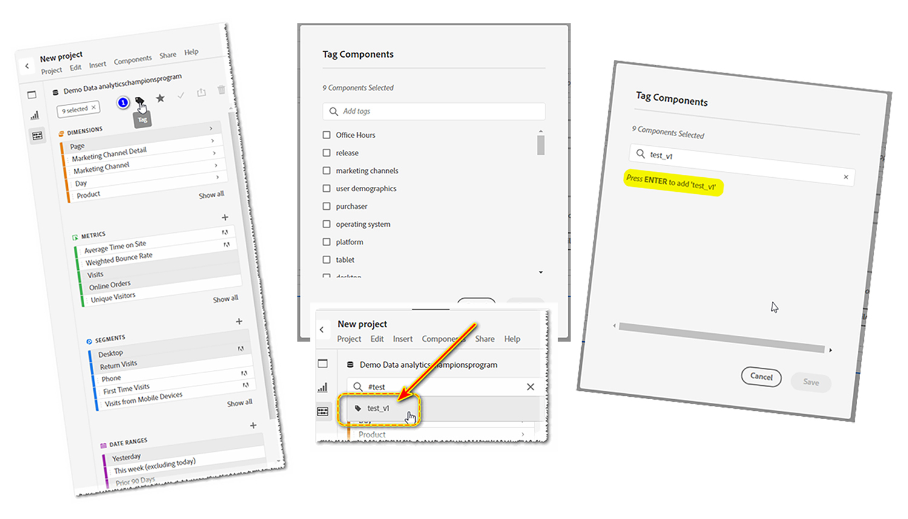

# Etiquetas: su asistente personal

_Descubra cómo #TAGS optimizar su análisis digital y servir como asistente personal para encontrar lo que necesita de manera eficiente. Jeff Bloomer, Campeón de Adobe Analytics, comparte información con expertos sobre cómo maximizar el potencial de la herramienta para su beneficio._

Todo el mundo recuerda jugar un buen juego de etiqueta o incluso esconderse y buscar, cuando éramos niños, ¿verdad?

La mejor parte fue cuando fuimos nosotros los que volvimos a la base (tag) o nos quedamos escondidos durante más tiempo (ocultar y buscar) hasta que escuchamos a alguien gritar, &quot;¡Olly Olly bueyes libres!&quot; (&quot;Todos vosotros salid libres&quot;, derivado del alemán: &quot;alle alle auch sind frei!&quot;).  Lo que en última instancia significaba que todos los demás habían llegado a la base, habían sido encontrados, o alguien fue etiquetado como &quot;eso&quot;, y todavía estábamos libres para jugar otra ronda!

La parte importante es si el juego era de etiqueta o esconderse y buscar, estábamos jugando una actividad divertida donde todos fueron encontrados una y otra vez.

Cuando recurrimos a nuestros trabajos diarios, la búsqueda de cosas parece volverse mucho menos aventurera y mucho más tediosa. Pero no tiene por qué serlo si estamos dispuestos a poner un poco de trabajo en el front-end.  Una frase bien conocida por mi familia es: &quot;La mayor parte del dolor es autoinfligido&quot;. Sin embargo, aunque puede parecer un poco anticuado en estos días, hay una frase más famosa que también es muy relevante en esta situación: &quot;Una puntada en el tiempo ahorra nueve&quot;. - Benjamin Franklin

Ahora que tengo su atención, permítanme comenzar haciendo una pregunta:

¿Cuántos de ustedes han hecho esto?  Ha comenzado a buscar **dimensión**, **intervalo de fechas**, **segmento** o **métrica calculada**, y se inundará con esta lista gigante (vea **Figura 1**) de todo lo que NO desea.  ***Analysis Workspace*** cree que está tratando de ser útil, pero en realidad, ha logrado no serlo en absoluto.

*Figura 1 - Buscar &quot;año&quot;*

Mejor aún, has creado *nuevos* **intervalos de fechas** y **segmentos**, y como son &quot;muy nuevos&quot;, pensarías que al menos estos artículos deberían ser rápidos y fáciles de encontrar la próxima vez que entres en ***Adobe Workspace***. ¿Tengo razón?

Bueno, odio estallar tu burbuja, pero trata de dejar ***Adobe Analytics*** después de que hayas creado a todos tus nuevos &quot;amiguitos&quot;, y cuando regreses, la mayoría simplemente se han escapado.  Si tienes suerte, *tal vez* uno de ellos se quedó esperando por ti, pero el resto ya se fueron hace tiempo y juegan a las escondidas.

## Reescribir el libro de reglas

Así que, ese ha sido el juego desde el primer día, pero ¿y si pudiéramos cambiar las reglas?

De hecho, ¿y si pudiéramos crear nuestro propio asistente personal para cambiar esas reglas para siempre?

En serio, de lo que estamos hablando aquí, ¡es de ETIQUETAS!  Eso es correcto!!  Es nuestro amigo el hashtag, antes conocido como &quot;número&quot; y &quot;signo de almohadilla&quot;, tal como lo hemos visto en nuestros teléfonos.  Los músicos de por ahí incluso lo llamamos &quot;agudo&quot;.

Para aquellos de ustedes que *realmente* necesitan un recordatorio, se ve así: **#**

De todos modos, la razón por la que estamos hablando de **#tags** es porque se meten en ese &quot;cubo opcional&quot; de &quot;cosas aburridas y tediosas, asquerosas&quot; que todo el mundo tiende a ignorar (como Descripciones), porque todos tenemos tanta prisa por crear las cosas más importantes como, oh, no sé -

- Informes de Workspace
- Segmentos
- Métricas calculadas
- Intervalos de fechas

¡Enfréntenlo, amigos!  Lo que sea, hemos visto y oído todas las excusas para por qué se saltan:

&quot;Oh, hey, pero eso es fácil.  Siempre puedo volver más tarde y actualizar esas cosas en un par de pausas para almorzar, o tal vez incluso mientras estoy sentado en una conferencia y *ponerme todo al día*&quot;, dijeron todos los que NUNCA LO HICIERON.

## Qué hay en la caja de herramientas

**Adobe** incluso ha hecho a WE THE PEOPLE el servicio de crear un conjunto selecto de #TAGS directamente de la caja, porque, bueno... tuvieron que comenzar con nosotros en algún lugar.  Voy a proporcionar algunas advertencias adicionales en solo un poco, pero lo que estoy demostrando primero le dará el mayor golpe para su dinero!

Antes de crear cualquiera propio, lo que primero necesita saber es cómo buscar **etiquetas** existentes:

Tanto si se encuentra en un proyecto nuevo como si ya existe, solo necesita ir a la barra de búsqueda de componentes, escribir un #hashtag, junto con uno de estos términos principales (solo ver el vídeo) y pulsar INTRO; o bien, puede empezar a desplazarse hasta encontrar un término reconocible.

PRIMERA ADVERTENCIA: Algo que hay que tener en cuenta es que, si se mantiene fiel a las convenciones de nomenclatura correctas cuando empiece a crear las etiquetas *own*, con casi todas las etiquetas *con mayúsculas* que vea *should*, y yo tendré cuidado con la palabra &quot;should&quot; (debería), ser un **Adobe**, elemento etiquetado listo para usar.  Eso significa que debe asegurarse de que todas las etiquetas que cree estén en **minúsculas**.

## Creación de su propio asistente personal

Ahora, volvamos a lo que dije antes sobre un &quot;asistente personal&quot;.  ¿Y si les dijera que podrían empezar a seleccionar algunos de sus componentes favoritos existentes y luego hacerlos los los ÚNICOS que ven?

1. Si empieza a seleccionar varios componentes (CTRL+CLIC IZQUIERDO), verá que algunos iconos aparecen en la parte superior.  Uno de ellos será el icono de la ETIQUETA.
1. Haga clic en él y, a continuación, se abrirá el cuadro de diálogo ETIQUETAS, donde podrá ver las etiquetas existentes asociadas con esos componentes.
1. Es desde esta pantalla donde puede asignar cualquier **etiqueta adicional/nueva** que desee en este momento.  (Ejemplo: **test\_v1**)
1. Para agregar una etiqueta NEW a cualquier componente, simplemente pulsa **ENTER** en el teclado antes de hacer clic en el botón SAVE.
1. Luego, cuando haya asignado su nueva ETIQUETA, puede buscarla introduciendo hashtag(#), y su nueva ETIQUETA.

Disculpa el juego de palabras, pero &quot;#tag, ¡lo eres!&quot;  ¡Acaba de ahorrarse muchas menos búsquedas en el futuro!  Ahora puede ver dónde entrarán en juego finalmente su diligencia debida y su arduo trabajo.

## Poner a trabajar a su asistente personal

Supongamos que trabajamos en la **industria de viajes** y que estamos preparando un informe para su **horario comercial principal**.  Si empezáramos a buscar solo el término &quot;VIAJAR&quot;, podríamos obtener muchos más resultados de los que podríamos necesitar.  De hecho, si solo sacáramos un **Workspace** que contenga la mitad de los resultados que necesitábamos, los componentes aún no estarían disponibles.

Sin embargo, si a lo largo de nuestro trabajo diario hemos estado etiquetando con regularidad nuestros **segmentos**, **métricas** y otros **componentes** relevantes a medida que avanzamos, y quizás creando solo algunos nuevos en el momento en que creamos nuestro nuevo **espacio de trabajo**, ¡hemos demostrado seriamente cómo podemos reescribir el libro de reglas a nuestro favor!

En este caso, creé un #tag simple para todos estos elementos llamados: #core.

A medida que continúes haciendo de esto parte de tus hábitos de trabajo y mejores tus habilidades para hacerlo una y otra vez, te darás cuenta de que usar #tags se convertirá en algo más parecido a tener tu propio asistente personal.

¿Quieres más ejemplos reales? Consideremos lo siguiente:

1. Por ejemplo, ¿cómo encontrar fácilmente tus **segmentos** y tus **intervalos de fechas** para **todos los trimestres** en **2023**?

   

   *Una sugerencia adicional*: ¡Ese pequeño cuadrado a la derecha te permitirá incluso cambiar tu orden ordenado a *alfabético*!

1. Por supuesto, todos utilizan **códigos de seguimiento de campaña** hasta cierto punto.  Si quieres tener una visión clara de solo *tus* juguetes, considera agregar **#tag** s a los elementos principales que realmente necesitas ver y filtrar todo el ruido:

## ¡Ahora sal ahí y juega!

Claro, esconderse y buscar era divertido cuando era niño, pero ahora somos adultos.  No tenemos tiempo para buscar constantemente las cosas importantes, así que asegúrate de hacerte un favor y no pierdas más tiempo peleando con la herramienta.  Vuelva a escribir las reglas y haga que la herramienta funcione correctamente.

### ¡Tag, lo eres!

## Autor

Este documento fue escrito por:

**Jeff Bloomer**, gerente de análisis digital en Kroger Personal Finance

Campeona de Adobe Analytics
