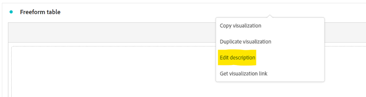

# Más que palabras: uso de visualizaciones de texto y descripciones en Analysis Workspace

Como un [!DNL Adobe Analytics] Usuario de Analysis Workspace, es natural que su enfoque vaya a menudo a sus datos y visualizaciones de datos. Cualquier persona puede escribir un resumen, ¿verdad? Sin embargo, pasar por alto funciones de Analysis Workspace como la visualización Texto o las descripciones de visualización pueden significar perder una valiosa oportunidad de combinar sus perspectivas con texto, imágenes, gifs y vínculos valiosos. Al proporcionar referencias y más contexto para informar a los usuarios sobre lo que significan los datos, puede hacerlo más eficaz e impactante.

Primero, asegúrese de saber dónde puede encontrar estas funciones:

- Para añadir o modificar la descripción de una visualización, simplemente haga clic con el botón derecho en el área superior del elemento y seleccione el vínculo &quot;Editar descripción&quot;:

  

- Para agregar un panel de texto independiente, haga clic en el menú Visualizaciones de la barra de navegación izquierda:

  

Aunque esta guía muestra un ejemplo con uno de estos dos métodos, puede realizar adiciones similares tanto en las descripciones como en las visualizaciones de texto. También puede ajustar el tono de fuente, la alineación, el color y crear listas con viñetas o numeradas:

Vamos a empezar... Un contexto muy útil para agregar a cualquier proyecto de Analysis Workspace es un hipervínculo: puede incluir vínculos a la dirección URL de la página detallada en el informe, vínculos a otros proyectos de Analysis Workspace, páginas de contexto de informe externas o cualquier otra cosa que pueda resultar útil tener a mano mientras ve el informe. Se puede acceder a esta función seleccionando cualquier parte del texto y el icono &quot;vincular&quot;:

El resultado es que cualquier persona que visualice el proyecto de Analysis Workspace puede acceder a cualquier página accesible para ellos en línea o en la intranet de su organización con un solo clic:

Ahora, si prefiere incluir el contenido directamente en el informe, puede utilizar un vínculo de imagen para colocar el contenido junto a los datos:

Puede agregar a su informe una imagen accesible desde cualquier dirección URL pública, siempre y cuando la dirección URL esté en *https* y tiene el formato .png, .jpeg, .jpg o .gif: aunque esto puede sonar restrictivo, cualquier herramienta en línea utilizada para compartir imágenes o GIF como imgur o GIPHY puede proporcionar un método rápido para cargar archivos accesibles en Workspace mediante un vínculo compartido.

¿El resultado? Puede mostrar la página web a la que hacen referencia los datos directamente en el proyecto:

También puede utilizar GIF en sus proyectos para incluir imágenes en movimiento como un tutorial del sitio, una ruta ideal a través del sitio o una tarea de la aplicación, o simplemente mostrar a su equipo cómo hacerlo ***alucinante*** sus informes ahora se han convertido en:

## Autor

Este documento fue escrito por:

**Dan Cummings**, Sr. Ingeniería de productos [!DNL Analytics] Gerente en McDonald&#39;s Corporation

[!DNL Adobe Analytics] Campeona
