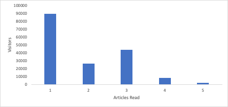

# Desbloquear perspectivas con histogramas: más allá de los promedios en [!DNL Analytics]

_Descubra el impacto de los histogramas en Analytics para obtener perspectivas que superan los promedios. Los histogramas revelan patrones de datos en el comportamiento de los clientes, la participación del visitante, el rendimiento técnico y los errores de formulario, lo que permite obtener perspectivas más profundas y tomar decisiones informadas en [!DNL Adobe] Workspace._

Vamos a saltar a la derecha en. Debería estar usando [histogramas](https://experienceleague.adobe.com/docs/analytics/analyze/analysis-workspace/visualizations/histogram.html). Voy a explicar por qué, pero quiero responder a su primera pregunta: ¿Qué es un histograma? Lo entiendo. La mayoría de las veces, cuando ves un montón de barras subiendo, podrías pensar que es un gráfico de barras. Sí, los histogramas son similares, pero les aseguro que son diferentes. Un gráfico de barras compara las cosas, mientras que un histograma muestra la frecuencia con la que se produjo una variable. Eche un vistazo. Este es un gráfico de barras:

Tenemos seis modelos, y podemos comparar los ingresos para cada modelo. Vemos que el modelo de Johannesburgo tiene la mayor cantidad de ingresos, mientras que Berlín tiene la menor.

Ahora, veamos un histograma:

En la parte inferior del eje x, tenemos el número de unidades compradas por cada cliente. La primera barra representa la frecuencia con la que un cliente compró una unidad, la segunda barra muestra cuántos clientes compraron dos unidades, y así sucesivamente, hasta los clientes que compraron diez o más unidades.

Entonces, ¿cómo es esto útil? Bueno, vemos que la mayoría de la gente sólo compra una unidad. Sigue declinando hasta que llegamos a cinco unidades. Luego se reduce de nuevo hasta que llegamos a diez unidades. Esto apunta al hecho de que a los clientes les gusta comprar en múltiplos de cinco, y tal vez deberíamos ofrecer precios especiales o embalaje para aprovechar eso. Pero ciertamente hay muchos otros usos también.

## Explicación de la participación del visitante

Si el sitio o la aplicación depende del tráfico repetido, le interesa saber cuántos visitantes regresan y con qué frecuencia. Uno de los histogramas más simples que puede usar es averiguar cuántos visitantes regresan más de una vez. A medida que rastrea ese histograma con el tiempo, puede ver su progreso, ya que ojalá las barras de la derecha sean más altas y las de la izquierda sean más cortas.

Tal vez quieras mantener a la gente en el sitio, leyendo artículos. Un histograma que muestre cuántos visitantes leen cantidades diferentes de artículos le daría una idea del nivel de participación. ¿Por qué es útil? Supongamos que la mayoría de los visitantes leen un artículo y se van, pero algunos visitantes muy comprometidos leen tres artículos y se van. ¡Esa es una gran información! Ahora sabe que debe personalizar la página en el primer y tercer artículo leído con el objetivo de que los visitantes lean un artículo más.

## Explicación del comportamiento del cliente

El propietario del producto para registros de pacientes en un sistema hospitalario me pidió algunos datos. Había seis regiones para elegir para obtener sus registros médicos. Quería saber cuántas personas estaban haciendo clic en más de uno. Creé un histograma que mostraba cuántos visitantes hacían clic en las opciones 1, 2, 3, 4, 5 o 6. Esto puede parecer excesivo, pero más de la mitad de los visitantes hacían clic en al menos dos opciones y un 3,2 % de los visitantes hacían clic en las seis. Con ese histograma frente a ella, saltó a la acción, reorganizó su hoja de ruta y simplificó las opciones a dos. Esto hizo que la experiencia del paciente fuera mucho más simple.

## Explicación del rendimiento técnico

Si configura un histograma para cuántos visitantes experimentan cuántos errores técnicos, puede obtener una buena comprensión del rendimiento técnico del sitio. Muchos visitantes que experimentan muchos errores técnicos es una señal para comenzar a priorizar esas correcciones técnicas.

## Explicación del rendimiento del formulario

Los mensajes de error en un formulario son una cuestión diferente. Son errores de visitantes, no errores de su parte. Sin embargo, podría beneficiarse de un histograma que le muestre cuántos visitantes están experimentando cuántos errores. Si ve un histograma que indica que muchos visitantes están experimentando muchos errores, es posible que no sea culpa suya. Esto sería una buena indicación de que el formulario tiene campos con nombres incorrectos, instrucciones poco claras o quizás un diseño que oculta campos obligatorios.

## ¿Por qué no una métrica calculada?

Puede preguntar: ¿en qué se diferencia esto de tener una métrica calculada? Oye, busco una buena métrica calculada. Creo que son herramientas absolutamente esenciales para entender el rendimiento de su sitio. El problema para muchos de los casos de uso que he enumerado, sin embargo, es que un promedio puede mostrar el tamaño del problema pero oscurecer el alcance del mismo. Veamos cómo los histogramas le proporcionan información adicional para algunos de los casos de uso anteriores:

- Participación del visitante: Si tiene un número promedio de historias leídas de 1.2, la personalización del primer artículo es bastante evidente. Echarás de menos que haya otro gran grupo que existe después de leer el tercer artículo, que es lo que el histograma hace obvio.

  

- Errores técnicos: si viera un promedio de 8,7 errores por visitante, sabría que tenía un problema. El histograma podría mostrar que el 97 % de los visitantes experimentan uno o menos errores, pero un puñado de periféricos están elevando el promedio. Entonces podría decidir que no vale la pena dedicar mucho tiempo a mejorar la experiencia de ese pequeño grupo de periféricos.

  

- Errores de formulario: si tiene un promedio de 3,6 mensajes de error de formulario por visitante, eso es un indicador de un problema. Es posible que tenga el mismo problema atípico que los errores técnicos, pero también se puede obtener una perspectiva al ver un pico en el histograma en un número determinado de errores. ¿Un gran pico en un error? Esto podría ser un problema común que experimenten todos estos visitantes o tal vez todos obtuvieron un error diferente una vez. ¿Un pico gigante en tres errores? Ah, ahora eso es interesante. Si esto da lugar a una investigación que muestra que se trata de los mismos tres errores, se ha centrado en los datos que le proporcionan una comprensión de los visitantes y le ayudan a solucionar lo que es probable en un grupo de problemas interrelacionados.

  

Como puede ver, los histogramas no solo tienen sus propios usos, sino que también profundizan la perspectiva que se obtiene de un promedio. Son una visualización lista para usar en [!DNL Adobe Analytics] y fáciles de crear. Esperamos que estos casos de uso le sean útiles o le inspiren. ¡Feliz visualización!

## Autor

Este documento fue escrito por:

**Gitai Ben-Ammi**, consultora principal en Concentrix Catalyst

[!DNL Adobe Analytics] campeón
