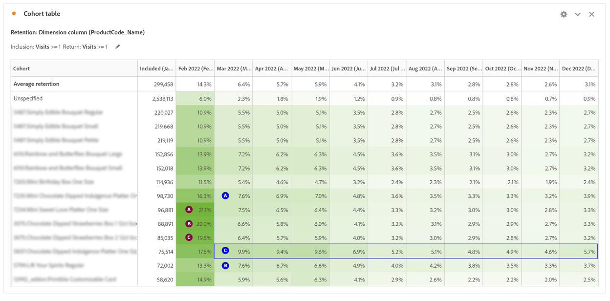

# Uso del análisis de cohorte para comprender el comportamiento del cliente

Para mejorar la experiencia del cliente y los ingresos, las empresas deben comprender el comportamiento del cliente. El análisis de cohorte puede ayudar a comprender la participación y la retención, lo que conduce a acciones como mejorar la creación de cuentas y crear campañas para meses de gran volumen.

El análisis del rendimiento digital es crucial para comprender cómo interactúan los clientes con un negocio y qué acciones se pueden tomar para mejorar su experiencia. En esta publicación de blog, exploraremos cómo utilizar el análisis de cohorte para comprender mejor el comportamiento de los clientes.

## Parte 1: Comparación del rendimiento digital entre visitas de primera y de retorno

### Configuración del escenario

Un cliente quiere comprender el rendimiento digital de los últimos 2 años y está considerando desarrollar un programa de fidelidad para impulsar el rendimiento digital. Para empezar, podemos ver la combinación actual de sitios entre usuarios nuevos y repetidos para comprender cómo se comportan hoy los dos grupos de visitantes.

Rendimiento digital actual

1. En 2022, el 62 % de los pedidos procedían de visitas por primera vez, frente al 38 % de los pedidos de visitas de retorno (sujetos a cookies, varios dispositivos).
1. Las visitas por primera vez se convierten a una tasa ligeramente superior a las visitas de retorno para ambos, 11,6 % frente al 11,4 %.
1. En comparación con 2021, las tasas de conversión disminuyeron en ambos segmentos.

## Parte 2: Análisis de cohorte: Visitas a arreglos comestibles Producción global

Para comprender la permanencia del canal digital y la oportunidad de impulsar a los compradores repetidos, la siguiente pregunta a responder es: ¿Cuál es el volumen de visitantes que regresan al sitio cada mes en 2022?

### Introducción al análisis de cohorte

El análisis de cohorte es una herramienta útil para comprender cómo las cohortes se relacionan con una marca a lo largo del tiempo. Para empezar, determinamos qué preguntas responder:

1. En un año determinado, ¿cuál es el período de retención promedio por mes?
1. ¿Qué volumen de visitantes regresa cada mes en un año determinado?
1. ¿Cuál es el impacto de los inicios de sesión en la retención?
1. ¿Hay productos específicos que condujeron a una mayor retención?

Cómo configurar la tabla de cohorte

1. Establezca el intervalo de fechas en de enero a diciembre de 2022
1. **Criterios de inclusión:** visitas
1. **Criterios de retorno:** visitas
1. **Granularidad:** Mes
1. **Configuración:** cálculo móvil
\*\*Permite calcular la retención en función de la columna anterior, no de la columna incluida. Esto significa que se incluye un usuario en cada uno de los meses\*\*
1. **Segmentos:** puede seleccionar segmentos específicos para llevar este análisis más lejos
   1. Páginas de aterrizaje específicas
   1. Device Type
   1. Canales de marketing
   1. Etc

### Interpretación de los resultados

**En 2022:**

1) Los meses con las tasas de retención más altas +1 mes incluyen enero, abril y noviembre
1) Los meses con mayor volumen son febrero y mayo
1) Hay ~1,000 visitantes que regresan al sitio cada mes

**En 2021:**

1) Los meses con las tasas de retención más altas +1 mes incluyen abril, enero y marzo
1) Los meses con mayor volumen son febrero y mayo

**Elementos de acción:**

Cree un segmento basado en los cerca de 1000 visitantes y obtenga más información sobre ellos:

- ¿Dónde se encuentran?
- ¿Qué productos compran a lo largo del año?
- ¿De qué tiendas están comprando?

Los meses clave resaltan la oportunidad de impulsar la retención en función del volumen:

- ¿Existen tácticas específicas que puedan generar una adherencia adicional durante febrero y mayo para aprovechar el volumen?

Análisis de repetición de pedidos para comprender los compradores repetidos

- ¿Son las tasas de retención más altas +1 mes para los mismos meses?
- ¿Los meses más altos de visitas son los mismos para los pedidos?

## Parte 3: Añadir dos métricas a los criterios de inclusión

### Comprender el impacto del inicio de sesión

Dado que este cliente desea comprender el valor de un programa de fidelización, el siguiente paso del análisis incluía la adición del evento de éxito de inicio de sesión como métrica de inclusión a la cohorte.

Advertencia: el análisis de cohorte no se puede usar para métricas calculadas (como Tasa de conversión) o métricas que no sean enteras (como Ingresos). Solo se pueden usar las métricas de los segmentos en Análisis de cohorte y solo se pueden incrementar en >1 a la vez.

¿Es más probable que el sitio conserve a los usuarios que inician sesión?

¿Cuál sería el impacto si pudiéramos conseguir que más usuarios iniciaran sesión? ¿Es una experiencia más pegajosa?

### Configuración de la tabla de cohorte

1. **Establecer intervalo de fechas:** de enero a diciembre de 2022
1. **Criterios de inclusión:** Visitas + Evento de éxito de inicio de sesión
1. **Criterios de retorno:** visitas
1. **Granularidad:** Mes
1. **Configuración:** cálculo móvil
\*\*Permite calcular la retención en función de la columna anterior, no de la columna incluida. Esto significa que se incluye un usuario en cada uno de los meses\*\*

### Interpretación de los resultados

**En 2022:**

1) Los meses con las tasas de retención más altas +1 mes incluyen enero, abril y noviembre (los mismos meses que la primera tabla de cohorte)
1) Los meses con mayor volumen son febrero, mayo y diciembre
1) Hay ~2500 visitantes que regresan cada mes \*\*más del doble\*\*

**Elementos de acción:**

Investigue la experiencia del usuario del sitio para hacer que los usuarios creen una cuenta durante el cierre de compra

## Parte 4: Cohorte de Dimension personalizada

Cohorte de Dimension personalizada: cree cohortes basadas en la dimensión seleccionada, no en el tiempo (opción predeterminada). Muchos clientes desean analizar sus cohortes en función de un criterio distinto del tiempo. La nueva función de cohorte de Dimension personalizada ofrece la flexibilidad para generar cohortes basadas en dimensiones de su elección. Utilice dimensiones como canal de marketing, campaña, producto, página, región o cualquier otra dimensión de [!DNL Adobe Analytics] para mostrar cómo cambia la retención en función de los distintos valores que adoptan. Las

La definición del segmento de la cohorte de Dimension personalizada aplica el elemento de dimensión solo como parte del periodo de inclusión, y no como parte de la definición de regreso.

Después de elegir la opción Cohorte de Dimension personalizada, puede arrastrar y soltar cualquier dimensión que desee en la zona de colocación. Esto le permite comparar elementos de dimensión similares durante el mismo periodo de tiempo. Por ejemplo, puede comparar el rendimiento de las ciudades en paralelo con

productos, campañas, etc. Devuelve sus 14 elementos de dimensión principales. Sin embargo, puede utilizar un filtro (al que se accede manteniendo el puntero a la derecha de la dimensión que ha arrastrado) para mostrar solo los elementos de dimensión que desee. No se puede utilizar una cohorte de Dimension personalizada con la función de tablas de latencia.

### ¿Qué productos están impulsando la adherencia del sitio?

La tabla de cohorte de Dimension personalizados resalta los productos que generan tasas de retención más altas que la media.  Esta tabla ayuda a identificar los productos principales para impulsar campañas de marketing internas y externas con los productos más destacados.

**En febrero:** 3 productos se destacan con tasas de retención más altas

1) Product 1
1) Product 2
1) Product 3

**En marzo:**

1) Product 1
1) Product 2
1) Product 3: con frecuencia supera con una tasa de retención más alta en comparación con la retención media.

## Conclusión

El análisis de cohorte y la cohorte de Dimension personalizada son herramientas potentes para comprender el comportamiento de los clientes y mejorar el rendimiento digital. Al analizar las tasas de retención, las tasas de inicio de sesión y el impacto de productos específicos, las empresas pueden tomar decisiones basadas en datos para mejorar la experiencia del cliente e impulsar el crecimiento.

## Autor

Este documento fue escrito por:

**Jennifer Yacenda**, Director sénior en Marriott

[!DNL Adobe Analytics] campeón
